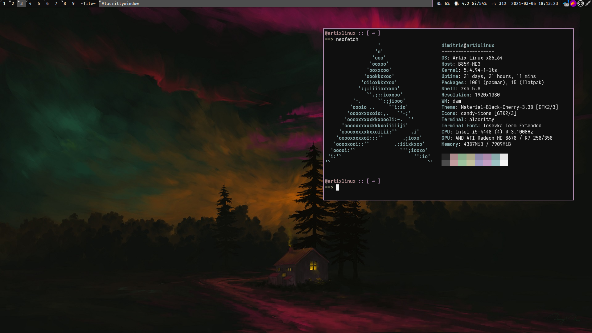

DWM - dynamic window manager
============================
DWM is an extremely fast, small, and dynamic window manager for X. Instead of using a configuration file, this window manager is customized through editing its source code. All settings are included in the resulting binary offering better security at the cost of some ease of use. This version includes patches that aim to keep it's minimalistic nature while addressing some usability issues that come with it.

Here is a screenshot of my current setup for reference:



Features
------------

* Move windows up the stack with `Mod+Shift+J/K`
* `Tile`, `Monocle` and `Deck` layouts
* Fullscreen with `Mod+f` using the `Monocle` layout (**fullscreen patch**)
* All window titles shown in the bar (**bartabgroups patch**)
* EWMH Compliance (**ewmhtags patch**)
* Different layouts per tag (**pertag patch**)
* System tray (**systray patch**)
* Mouse follows focused window (**warp patch**)
* Urgent windows automatically gain focus
* Gaps on all layouts (**uselessgap patch**)

Requirements
------------
In order to build dwm you need the `Xlib` header files.

### If you plan to use the default configuration some programs are also required:
* **For keybinds, on `config.h`**
  * My patched [dmenu](https://github.com/dimspith/dmenu) version (command launcher)
  * `rofi` (program launcher)
  * `firefox` (browser)
  * `emacs` (editor)
  * `alacritty` (terminal emulator)
  * `flameshot` (screenshots) 
* **For startup, on `startdwm`**
  * `wmname` (for misbehaving applications)
  * `emacs` (for the daemon)
  * `nitrogen` (wallpaper setting)
  * `dunst` (notification daemon)
  * `picom` (compositor)
  * (OPTIONAL) `xfce4-power-manager` (for battery and power management)
  * (OPTIONAL) `setxkbmap` (for language configuration. the default is EN|GR with RCTRL as a toggle)
* **For the status bar**
  * My patched [slstatus](https://github.com/dimspith/slstatus) version 

### If you don't plan on using the defaults here is how to change them:
#### **Changing programs on keybinds**

Go to the `config.h` file in the section indicated in the screenshot below.


Here we can see all the programs that were mentioned above. You can change any option but make sure you follow the above format. i.e:
``` bash
$ ls -l -a
```
must be written as
``` c
... = {"ls", "-l", "-a", NULL}
```

The dmenu variable (`dmenucmd`) starts dmenu with the same colors as dwm. 4 additional parameters are included because a patched version is used. If you want to use the default dmenu, simply remove the line range from `"-hf"` to `"-shb"`. For more info go here.

#### **Changing programs running on startup**
Edit the `startdwm` file and add or remove any commands you want to run when dwm starts.

Make sure the command ends with `&` as dwm will not start otherwise.

i.e to add steam we include the line `steam &`

#### **Changing the status bar**

Delete the `slstatus &` line on the `startdwm` file and add your own.

More info on alternatives can be found [here](https://dwm.suckless.org/status_monitor/)

Here is a minimal example of a custom status bar that could be included in the `startdwm` file:

    while xsetroot -name "`date` `uptime | sed 's/.*,//'`"
    do
    	sleep 1
    done &
    exec dwm

Installation
------------
Edit config.mk to match your local setup (dwm is installed into
the `/usr/local` namespace by default).

Afterwards enter the following command to build and install dwm (if
necessary as root):

    make clean install

The following changes are made when installing dwm:
* The `dwm` binary and `startdwm` script are installed on the specified namespace (`/usr/local/` by default) and made executable
* The directories `/usr/share/xsessions` and `~/.cache` are created.
* The desktop file `dwm.desktop` is copied in `/usr/share/xsessions` for use with login managers
* A manpage entry is created (on `/usr/local/share/man` by default)

If you make any changes to the header files or source code of dwm you should rebuild and install dwm to apply your changes by running `make clean install` again.

Running dwm
-----------Floating layout
#### The easy way

If you have a login manager installed a new entry should appear allowing you to run dwm directly.

#### The manual way

Add the following line to your .xinitrc to start dwm using startx:

    exec startdwm

In order to connect dwm to a specific display, make sure that
the DISPLAY environment variable is set correctly, e.g.:

    DISPLAY=foo.bar:1 exec startdwm

(This will start dwm on display :1 of the host foo.bar.)


Keybindings
-----------

### Launching Programs

|Keybind      |Action                   |Default      |  
|-------------|-------------------------|-------------|
| Mod-p       | Launch Command Launcher | Dmenu       |
| Mod-Shift-p | Launch Program Launcher | Rofi        |
| Mod-Return  | Launch Terminal         | Alacritty   |
| Mod-Shift-b | Launch Browser          | Firefox     |
| Mod-Shift-e | Launch Editor           | Emacsclient |
| Mod-Shift-f | Launch File Manager     | Vifm        |

### Miscellaneous

|Keybind            |Action                             |
|-------------------|-----------------------------------|
| Mod-j             | Focus next window                 |
| Mod-k             | Focus previous window             |
| Mod-Space         | Focus master window               |
| Mod-Shift-j       | Move window forward               |
| Mod-Shift-k       | Move window backward              |
| Mod-i             | Increase master window capacity   |
| Mod-o             | Decrease master window capacity   |
| Mod-u             | Reset master window capacity      |
| Mod-h             | Decrease master window size       |
| Mod-l             | increase master window size       |
| Mod-Shift-Return  | Move focused window to master     |
| Mod-Tab           | Switch to previous tag            |
| Mod-Shift-q       | Kill focused window               |
| Mod-t             | Tiling layout                     |
| Mod-f             | Fullscreen focused window         |
| Mod-m             | Monocle layout                    |
| Mod-d             | Deck layout                       |
| Mod-Control-f     | Floating layout                   |
| Mod-Shift-Space   | Toggle floating on focused window |
| Mod-0             | Show all tags                     |
| Mod-Shift-0       | Show focused window on all tags   |
| Mod-,             | Focus previous monitor            |
| Mod-.             | Focus next monitor                |
| Mod-1..9          | Focus tags 1..9                   |
| Mod-Shift-1..9    | FMove window to tags 1..9         |
| Mod-Shift-r       | Restart dwm                       |
| Mod-b             | Toggle bar visibility             |
