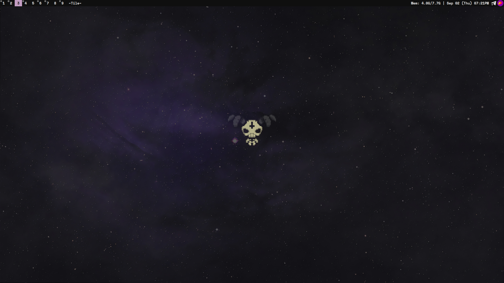
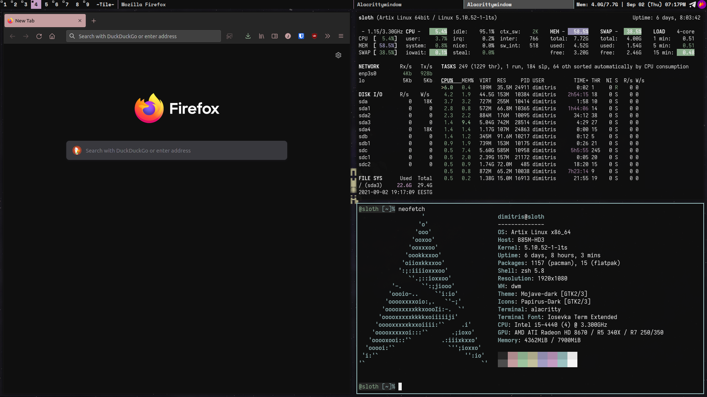

DWM - dynamic window manager
============================
DWM is an extremely fast, small, and dynamic window manager for X that is customized by editing it's source code.
This version includes patches that aim to keep it's minimalistic nature while addressing some usability issues that come with it.

Here are two screenshots showcasing a clear desktop along with a busy one. The wallpaper can be found [here](https://whvn.cc/y8552x)

Features
------------

* Move windows through the stack with `Mod+Shift+J/K` and `Mod+Shift+Enter` to swap with the master window.
* `Tile`, `Monocle` and `Deck` layouts
* Fullscreen with `Mod+f` using the `Monocle` layout (**fullscreen patch**)
* All window titles shown in the bar (**bartabgroups patch**)
* EWMH Compliance (**ewmhtags patch**)
* Different layouts per tag (**pertag patch**)
* System tray (**systray patch**)
* Mouse follows focused window (**warp patch**)
* Urgent windows automatically gain focus (see `756a62b`)
* Gaps on all layouts (**uselessgap patch**)
* i3-style scratchpads (**dwm-scratchpads patch**) 
* Custom scripts for controlling brightness and volume

Requirements
------------
In order to build dwm you need the `Xlib` header files.

### If you plan on using the default configuration the following packages are required:
* **For keybindings, on `config.h`**
  * My (lightly) patched [dmenu](https://github.com/dimspith/dmenu) version (command launcher)
  * `rofi` (program launcher)
  * `firefox` (browser)
  * `emacs` (editor)
  * `alacritty` (terminal emulator)
  * `flameshot` (screenshots) 
* **For startup, on `startdwm`**
  * `wmname` (for misbehaving applications)
  * `emacs` (for the daemon)
  * `nitrogen` (wallpapers)
  * `dunst` (notification daemon)
  * `picom` (compositor)
  * `volctl` (volume icon)
  * `cmst` (connmand applet for networking)
  * (OPTIONAL) `setxkbmap` (for language configuration. the default is EN|GR with RCTRL as a toggle)
* **For the status bar**
  * My patched [dwmblocks](https://github.com/dimspith/dwmblocks) (can be replaced in `startdwm`)

Installation
------------
Edit config.mk to match your local setup (dwm is installed into
the `/usr/local` namespace by default).

Run:
* `make` to build dwm
* `make deps` (optional) to install custom user-local stuff. The following are included:
  * Fonts from the `fonts` directory.
  * Custom scripts from the `scripts` directory.

Afterwards enter the following command to install dwm (if
necessary as root):

    make clean install

The following changes are made when installing dwm:
* The `dwm` binary and `startdwm` script are installed on the specified namespace (`/usr/local/` by default) and made executable.
* The `/usr/share/xsessions` directory is created.
* The desktop file `dwm.desktop` is copied in `/usr/share/xsessions` to be used with login managers.
* A manpage entry is created (on `/usr/local/share/man` by default).

If you make any changes to the header files or source code of dwm you should rebuild and install dwm to apply your changes by running `make clean install` again.

Running dwm
-----------

#### The easy way

If you have a login manager installed a new entry should appear allowing you to run dwm directly.

#### The manual way

Add the following line to your .xinitrc to start dwm using startx:

    exec startdwm

In order to connect dwm to a specific display, make sure that
the DISPLAY environment variable is set correctly, e.g.:

    DISPLAY=foo.bar:1 exec startdwm

(This will start dwm on display :1 of the host foo.bar.)

Keybindings
-----------

### Launching Programs

| Shortcut    | Action                  | Default Program |
|-------------|-------------------------|-----------------|
| Mod-p       | Launch Command Launcher | Dmenu           |
| Mod-Shift-p | Launch Program Launcher | Rofi            |
| Mod-Return  | Launch Terminal         | Alacritty       |
| Mod-Shift-b | Launch Browser          | Firefox         |
| Mod-Shift-e | Launch Editor           | Emacsclient     |
| Mod-Shift-f | Launch File Manager     | nnn             |
| Alt-Tab     | Launch Window Switcher  | Rofi            |

### Miscellaneous

| Shortcut         | Action                            |
|------------------|-----------------------------------|
| Mod-j            | Focus next window                 |
| Mod-k            | Focus previous window             |
| Mod-Space        | Focus master window               |
| Mod-Shift-j      | Move window forward               |
| Mod-Shift-k      | Move window backward              |
| Mod-i            | Increase master window capacity   |
| Mod-o            | Decrease master window capacity   |
| Mod-u            | Reset master window capacity      |
| Mod-h            | Decrease master window size       |
| Mod-l            | increase master window size       |
| Mod-Shift-Return | Move focused window to master     |
| Mod-Tab          | Switch to previous tag            |
| Mod-Shift-q      | Kill focused window               |
| Mod-t            | Tiling layout                     |
| Mod-f            | Fullscreen focused window         |
| Mod-m            | Monocle layout                    |
| Mod-d            | Deck layout                       |
| Mod-Control-f    | Floating layout                   |
| Mod-Shift-Space  | Toggle floating on focused window |
| Mod-0            | Show all tags                     |
| Mod-Shift-0      | Show focused window on all tags   |
| Mod-,            | Focus previous monitor            |
| Mod-.            | Focus next monitor                |
| Mod-1..9         | Focus tags 1..9                   |
| Mod-Shift-1..9   | Move window to tags 1..9          |
| Mod-Shift-r      | Restart dwm                       |
| Mod-b            | Toggle bar visibility             |
| Mod--            | Show/hide windows in scratchpad   |
| Mod-Shift--      | Hide window in scratchpad         |
| Mod-=            | Remove window from scratchpad     |
